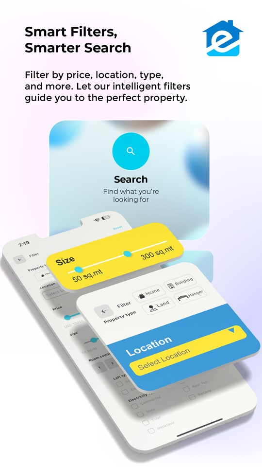
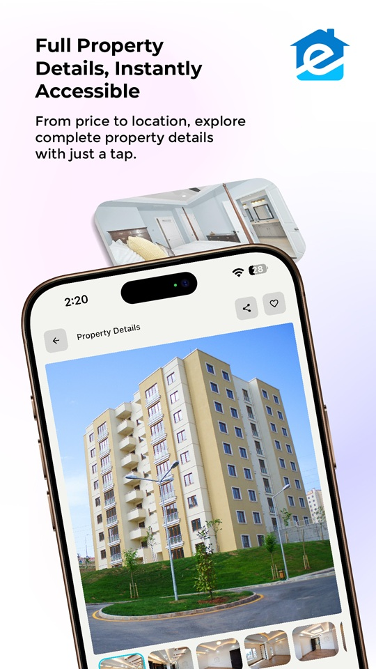
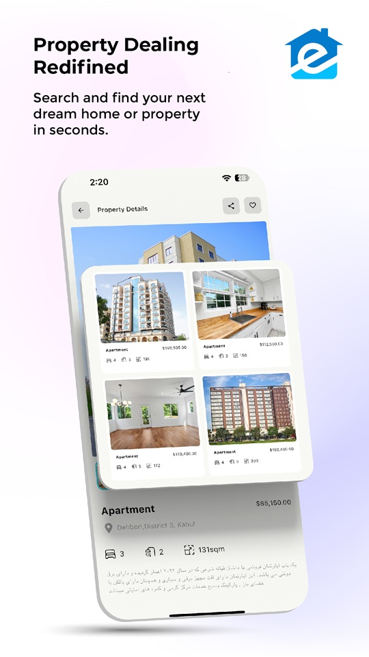

# 🏠 Emllak Mobile Application

**Emllak** is a modern real estate mobile application designed to simplify the process of browsing, buying, and renting properties. The app provides users with a smooth, intuitive experience for exploring real estate listings, viewing property details, and contacting sellers or agents directly.

## 🚀 Features

- 🏘️ Browse latest property listings
- 🔍 Filter by location, price, type, and more
- 📱 View detailed information and photos of each property
- 💬 Contact property owners or agents directly from the app
- ❤️ Save favorite properties for later
- 🌐 Multi-language support (Dari, Pashto, English)

## 📸 Screenshots

  
  
  

## 🛠️ Technologies Used

- **Flutter** – Cross-platform mobile development  
- **Dart** – Core programming language  
- **Supabase** – Database and authentication backend  
- **Firebase** – Push notifications and analytics  
- **REST API** – Backend communication  

